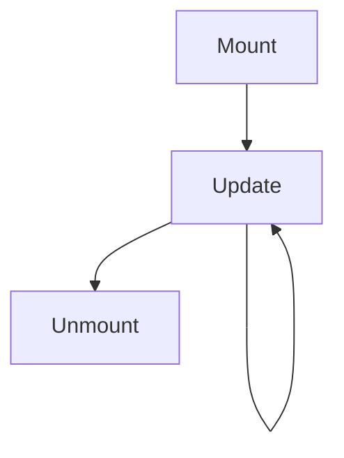

# React basic

## Rendering react components.

The react component is usually represented by a function component:

- The component returns HTML similar markup called `JSX`. The difference between HTML and JSX is that JSX allows for variable injection using `{someVariable}` and can reference other react components by capitalizing the tag.

```tsx
// Variable injection
const myTitle = "My title";
<h1>{myTitle}</h1>

// Referencing React components
<div>{/* HTML */}
   <MyReactComponent></MyReactComponent>{/* React component*/}
</div>
```

- The parameters of the function is usually referred to as `props`. During usage of a component props are assigned values through tag-attributes.

```tsx
import { type FC } from "react";

// Defining the MyButton component and its props.
type MyButtonProps = {
  title: string;
  onClick: () => void;
};

const MyButton: FC<MyButtonProps> = (props) => {
  const { onClick, title } = props;
  return <button onClick={() => onClick()}>{title}</button>;
};

// Using the MyButton component and assigning values
const MyApp: FC = () => {
  return (
    <div>
      <MyButton title={title} onClick={() => alert("CLICKED")} />
      {/* Assigning the prop values through tag attributes */}
    </div>
  );
};
```

### Tasks

#### 1. Start by adding the types for your articles in a file called `articles.ts` in the `src` folder. Extend the types and export a variable with three articles matching:

```ts
// articles.ts
export const articles: Article[] = [
  {
    slug: "article-1",
    title: "This is the title of the first article",
    description:
      "This is an article description that summarizes the article body.",
    body: "This is the article body containig the entire article text. The article text is longer that the descripton.",
    tagList: ["Tag 1", "Tag 2"],
    createdAt: "2023-06-26T06:06:10.816Z",
    updatedAt: "2023-06-26T06:06:10.816Z",
    favorited: false,
    favoritesCount: 124,
    author: {
      username: "coolBanana",
      bio: "Likes apples",
      image: "image",
      following: false,
    },
  },
  {
    slug: "article-2",
    title: "This is the title of the second article",
    description:
      "This is an article description that summarizes the article body.",
    body: "This is the article body containig the entire article text. The article text is longer that the descripton.",
    tagList: ["Tag 1", "Tag 2", "Tag 3"],
    createdAt: "2023-06-25T06:05:11.817Z",
    updatedAt: "2023-06-25T06:05:11.817Z",
    favorited: false,
    favoritesCount: 2421,
    author: {
      username: "coolBanana",
      bio: "Likes apples",
      image: "image",
      following: false,
    },
  },
  {
    slug: "article-3",
    title: "This is the title of the third article",
    description:
      "This is an article description that summarizes the article body.",
    body: "This is the article body containig the entire article text. The article text is longer that the descripton.",
    tagList: ["Tag 2", "Tag 3"],
    createdAt: "2023-06-24T08:02:15.231Z",
    updatedAt: "2023-06-24T08:02:15.231Z",
    favorited: false,
    favoritesCount: 168,
    author: {
      username: "chillApple",
      bio: "Likes Bananas",
      image: "image",
      following: false,
    },
  },
];
```

<details>
<summary> Suggestion 💡</summary>

```jsx
// types.ts
export interface Article {
  slug: string;
  title: string;
  description: string;
  body: string;
  tagList: string[];
  createdAt: string;
  updatedAt: string;
  favorited: boolean;
  favoritesCount: number;
  author: {
    username: string,
    bio: string,
    image: string,
    following: boolean,
  };
}
```

```jsx
// articles.ts
import { Article } from "./types";

export const articles: Article[] = {
    ...
}
```

</details>

#### 2. Display the article data in the `App.tsx`

- Import the articles file.
- Extract the first article.
- Change the existing markup to better fit an article.

<details>
<summary> Suggestion 💡</summary>

```jsx
// App.tsx
import { articles } from "./articles";
import "./App.css";

const App = () => {
  const article = articles[0];

  return (
    <div className="article-preview">
      <div>
        <a href="/">{article.author.username}</a>
        <span className="subtitle1">
          {new Date(article.createdAt).toLocaleDateString()}
        </span>
      </div>
      <h1>{article.title}</h1>
      <p className="description">{article.description}</p>
      <span className="subtitle1">Read more...</span>
      <ul className="tag-list">
        {article.tagList.map((tag, index) => (
          <li key={`tag-${index}-${tag}`} className="tag">
            {tag}
          </li>
        ))}
      </ul>
    </div>
  );
};

export default App;
```

</details>

#### 3. Now create a second article-preview structure.

#### 4. Create ArticlePreview component

In order to display more that one article we can use the concept of components to make our code scale well.

- Create a folder to hold our components - `src/components`.
- Creat a folder for our to-be-created `ArticlePreview` component where we can store files relevant for that component.
- Create `ArticlePreview.tsx`.
- Move the entire `return` statement from `App` into the new component.
- Make the new component take an article as prop.
- Define an interface for the component's props. In this case only an article.

<details>
<summary>Suggestion 💡</summary>

```jsx
// ArticlePreview.tsx
import { Article } from "../../types";
import "./ArticlePreview.css";

interface Props {
  article: Article;
}

const ArticlePreview = ({ article }: Props) => {
  return (
    <div className="article-preview">
      <div>
        <a href="/">{article.author.username}</a>
        <span className="subtitle1">
          {new Date(article.createdAt).toLocaleDateString()}
        </span>
      </div>
      <h1>{article.title}</h1>
      <p className="description">{article.description}</p>
      <span className="subtitle1">Read more...</span>
      <ul className="tag-list">
        {article.tagList.map((tag, index) => (
          <li key={`tag-${index}-${tag}`} className="tag">
            {tag}
          </li>
        ))}
      </ul>
    </div>
  );
};

export default ArticlePreview;
```

> **Required and optional props**
>
> I this case the `article`-prop is required. Props in React can be either required or optional. Optional props ar indicated with a `?` before the semi-colon in the type declaration. You will see the component complain if you try to instanciate it without all required props defined.

</details>

#### 5. Use our new component in App

Now we can easily display more than one article at a time without having to write duplicate code.

- Use the `map` function in JavaScript to loop through all articles and display them using the new `ArticlePreview` component. Remember to give each list element a `key`.
- Pass the article objects into the component as props.

<details>
<summary> Suggestion 💡</summary>

```jsx
// App.tsx
import { articles } from "./articles";
import "./App.css";
import ArticlePreview from "./components/ArticlePreview/ArticlePreview";

const App = () => {
  return (
    <>
      {articles.map((article) => (
        <ArticlePreview key={article.slug} article={article} />
      ))}
    </>
  );
};

export default App;
```

</details>

#### 7. Add basic styling

- Create the `src/component/ArticlePreview.css` file and add appropriate styling.
- Import `ArticlePreview.css` in the `ArticlePreview.tsx` with the line: `import "./ArticlePreview.css";`;

<details>
<summary> Suggestion 💡</summary>

```css
/* App.css */
.article-preview {
  display: flex;
  flex-direction: column;
  margin: 20px;
  width: full;
}

.article-preview .description {
  font-weight: 300;
  font-size: 1rem;
  color: #999;
  margin-bottom: 16px;
  line-height: 1.3rem;
}

.tag-list {
  display: flex;
  gap: 8px;
  margin: 0;
  justify-content: end;
  list-style: none;
}

.tag-list .tag {
  font-size: 13px;
  font-weight: 300;
  font-style: italic;
  border: 1px solid #ddd;
  border-radius: 16px;
  color: #aaa;
  padding: 4px 8px;
}

.article-preview h1 {
  font-weight: 600;
  font-size: 24px;
  margin-bottom: 3px;
}

.subtitle1 {
  color: #bbb;
  font-size: 13px;
  display: block;
}
```

</details>

#### 6. Add header and more styling

In order to make our page look more like a real blog we want to add a header, as well as some more styling.

- Create a new folder `components/Header` and add two files to it: `Header.tsx` and `Header.css`.
- Update `App.tsx` to use the new header component.

<details>
<summary> Suggestion 💡</summary>

```jsx
// Header.tsx
import "./Header.css";

const Header = () => {
  return (
    <header className="header">
      <h1>Conduit</h1>
      <nav className="navbar">
        <ul>
          <li>
            <a href="/">Home</a>
          </li>
        </ul>
      </nav>
    </header>
  );
};
export default Header;
```

```css
/* Header.css */
.header {
  display: flex;
  justify-content: space-between;
  align-items: center;
  padding: 0 30px;
  background-color: #f5f5f5;
  min-height: 50px;
}

.header h1 {
  margin: 0;
  font-size: 2rem;
  font-weight: 400;
}

.navbar ul {
  list-style-type: none;
  margin: 0;
  padding: 0;
  display: flex;
  align-items: center;
  gap: 1rem;
}

.navbar a {
  text-decoration: none;
  color: black;
}

.navbar a:hover {
  text-decoration: underline;
}
```

```css
/* index.css */
body {
  margin: 0;
  font-family: sans-serif;
}
```

```jsx
// App.tsx
import { articles } from "./articles";
import "./App.css";
import ArticlePreview from "./components/ArticlePreview/ArticlePreview";
import Header from "./components/Header/Header";

const App = () => {
  return (
    <>
      <Header />
      <main className="content">
        {articles.map((article) => (
          <ArticlePreview key={article.slug} article={article} />
        ))}
      </main>
    </>
  );
};

export default App;
```

```css
/* App.css */
.content {
  max-width: 960px;
  margin: 0 auto;
  padding: 0 1.25rem;
}
```

</details>

## Adding interactivity using state

A react component has what we call a life-cycle. It consist of three steps, `Mounting`, `Updating`, `Unmounting`.

- Mounting occurs when the component is added during runtime.
- Updating occurs when the state or the component props changes.
- Unmounting occurs when the component is removed during runtime.



### State

Interactivity in react is handled in an _immutable_ way through state. The way to modifify state in basic react is through _hooks_.

> **Mutability and Immutability**
>
> > **Mutability** means that you can directly change or modify the values of an object or an array. In React, directly modifying the state, like changing the properties of an object, is considered mutable. Mutability can lead to _unpredictable behavior_ and make it _challenging to track state changes_.
>
> > **Immutability** means that once an object is created, its values cannot be changed. Instead, you create a new object with the updated values.
> > In React, updating state in an immutable way ensures that you can better understand and control state changes. Immutability is a fundamental principle in React because it helps optimize rendering and state management.

> **Hooks**
>
> Hooks allow function components to have access to state and other React features. They allow you to use state, perform side effects, and tap into the lifecycle of a component without needing to write a class.
>
> _Concepts of hooks_:
>
> - **Order** - Hooks have to be called in the same order each time the component renders. React relies on the order of hooks to keep track of their states and bindings.
> - **Stages/Lifecycle**: Hooks go through two stages: "Mounting" and "Updating". During the mounting stage, hooks are executed and their initial values are set. During the updating stage, hooks can be re-executed if the dependencies have changed.
>
> _Built-in hooks_
>
> - State hooks:
>   - `useState`: The most commonly used hook. It enables you to add local state to your functional components. It returns a pair of values: the current state value and a function to update that state. You can call the update function to modify the state value, triggering a re-render of the component.
>   - `useReducer`: Works similar to useState, but follows the Redux pattern of state management, using a reducer function to update the state based on dispatched actions.
> - Performance hooks:
>   - `useCallback`: Memoizes a function, preventing unnecessary re-renders of components that depend on it.
>   - `useMemo`: Memoizes the result of a computation, preventing expensive calculations from being repeated on each render.
> - Other hooks:
>   - `useEffect` - Enables you to perform side effects, like fetching data, subscribing to events, or updating the DOM, after the component has rendered.
>   - `useRef`: Provides a mutable reference that persists across renders, useful for accessing and modifying DOM elements or storing any mutable value.

### 1. (Optional) Add favorite functionality without state

Now we want to make the page interactive. We do that by using state and the `useState` hook. Before actually using state we thought it could be good idea to show what happens (or does not happen..) if we just manipulate the article object directly.

> NB: This code does not work! The component is not re-rendered when the button is clicked.

- Add a like button and give it appropriate styling.
- Create a `handleFavorite` function and attatch it to the button.
- Make the button update the `favorited` and `favoritesCount` values of the article object.

<details>
<summary> Suggestion 💡</summary>

```jsx
// ArticlePreview.tsx
import { Article } from "../../types";
import "./ArticlePreview.css";

interface Props {
  article: Article;
}

const ArticlePreview = ({ article }: Props) => {
  const handleFavorite = () => {
    article.favorited = !article.favorited;
    article.favorited ? article.favoritesCount++ : article.favoritesCount--;
  };

  return (
    <div className="article-preview">
      <div className="article-meta">
        <div className="info">
          <a href="/">{article.author.username}</a>
          <span className="subtitle1">
            {new Date(article.createdAt).toLocaleDateString()}
          </span>
        </div>
        <button
          className={article.favorited ? "favorited" : ""}
          onClick={handleFavorite}
        >
          Like {article.favoritesCount}
        </button>
      </div>
      <h1>{article.title}</h1>
      <p className="description">{article.description}</p>
      <span className="subtitle1">Read more...</span>
      <ul className="tag-list">
        {article.tagList.map((tag, index) => (
          <li key={`tag-${index}-${tag}`} className="tag">
            {tag}
          </li>
        ))}
      </ul>
    </div>
  );
};

export default ArticlePreview;
```

```css
/* ArticlePreview.css*/

... .article-meta {
  display: flex;
  justify-content: space-between;
}

.article-meta .info {
  display: inline-block;
}

.article-meta button {
  color: #5cb85c;
  background-color: transparent;
  border: 1px solid #5cb85c;
  border-radius: 0.25rem;
  padding: 0.25rem 0.5rem;
  cursor: pointer;
}

.article-meta button.favorited {
  background-color: #5cb85c;
  border-color: #3d8b3d;
  color: #fff;
}

.article-meta button:disabled {
  cursor: not-allowed;
  opacity: 0.65;
}

.article-meta button:hover {
  background: #5cb85c;
  color: white;
}
.article-meta button.favorited:hover {
  background: #3d8b3d;
}
```

</details>

### 2. Add favorite functionality with state

As you could see from the previous example the component did not respond to click. This can be fixed by using the `useState` hook. This hook let's React know that a value has changed and the component needs to re-render.

- Move the handle function to app - pass it down as prop.
- Create a state using the `useState` hook - use the static articles as initial state
- Update the handle function to set the state using the hook - update the selected articles object using the previous logic.

<details>
<summary> Suggestion 💡</summary>

```jsx
const App = () => {
  const [articleList, setArticleList] = useState(articles);

  const handleFavorite = (slug: string) => {
    setArticleList((prevArticles) => {
      return prevArticles.map((article) =>
        article.slug === slug
          ? {
              ...article,
              favorited: !article.favorited,
              favoritesCount: article.favorited
                ? article.favoritesCount - 1
                : article.favoritesCount + 1,
            }
          : article
      );
    });
  };

  return (
    <>
      <Header />
      <main className="content">
        {articleList.map((article) => (
          <ArticlePreview
            key={article.slug}
            article={article}
            handleFavorite={() => handleFavorite(article.slug)}
          />
        ))}
      </main>
    </>
  );
};
```

- Update `ArticlePreview` props to accept the handle function.

```jsx
interface Props {
  article: Article;
  handleFavorite: () => void;
}

const ArticlePreview = ({ article, handleFavorite }: Props) =>
```

</details>

Now the like functionality works as expected, incrementing and deceasing on-click and updating css-class accordingly. However if you try to refresh or click the `Home`-link you can see that the state dont persist - the web-page reloads the initial state.
