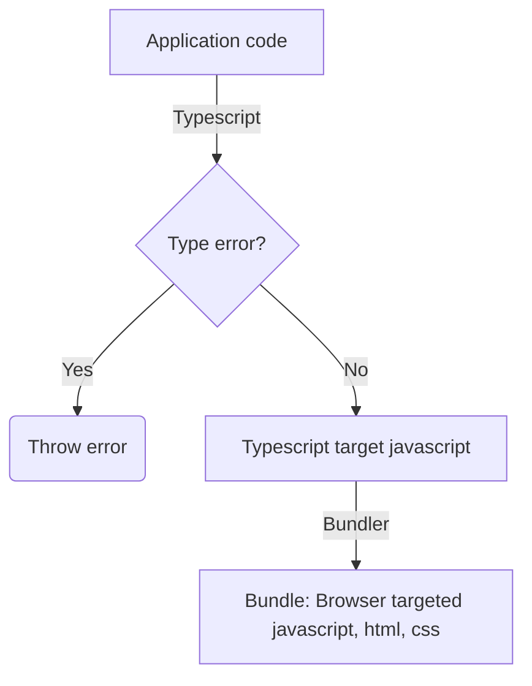

# Building for the web

## Purpose

Give an insight on how application code is deployed to users.

## A simple webapp

In our case we'll use the [vitejs](https://vitejs.dev/) framework as builder along with its react plugin.
A common alternative is [create-react-app](https://create-react-app.dev/) which is built with [Webpack](https://webpack.js.org/)

## Tasks

1. Set up your react project using vitejs.

- Run `npm init vite@latest vite-react-app -- --template react-ts`.
- Enter the `vite-react-app` folder to view your template project.
- Run `npm install` to install your dependencies.
- Run `npm run dev` to run your application. The application should be accessible at `http://localhost:5173/`.

2. Spend 10 minutes looking through the repository and familiarize yourself with the file types and folder directory.
3. Build the project by running the command `npm run build`. What changed in the repository?
4. Host the built app by running the command `npm run preview`. The application should be accessible at `http://localhost:4173/`.
